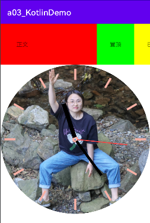

# a03_KotlinDemo
## 此demo为学习记录demo,会将自己实现过的功能框架的最基础版本代码记录下来,
## 不包含任何业务代码,便于遇到相似功能,或搭建新项目框架时的快速反应,避免重复造轮子,
##测试真机为华为P50_HarmonyOS_3.0.0
##虚拟机为Android12

1. 包含Java版Okhttp3封装，Retrofit+Rxjava网络请求框架封装可继续配合ViewModel+LiveData+ViewBinding实现MVVM架构
2. 包含Kotlin版Retrofit+ViewModel+LiveData+ViewBind实现MVVM架构
3. 包含自定义Viwe<表盘>与自定义ViewGroup<侧滑删除>
4. 包含手撸Rxjava实现create,map,flatMap,SubscribeOn,ObservableOn,RxBus,RxLifecycle,以及RxBinding与RxPermissions的使用
5. 包含手撸Handler,Demo版,手撸子线程Handler
6. 包含多进程多屏应用,Binder,广播，服务
7. 包含自定义Looper.Printer实现BlockCannary打印主线程卡顿堆栈,通过编舞者打印卡顿时长与丢帧信息
8. 包含自定义Fragment栈管理
9. 添加图文文件文件io操作

##后期计划
1. 会将之前很早基于ijkplayer封装的播放控制器的代码移植过来,之前的代码在HappyJie135588(可能跑不起来)
2. 会将之前写的一个自定义ViewGroup的数据请求View移植过来,包含网络请求的加载中,加载失败，空数据，加载成功状态控制
3. 会将之前写的一个基于BaseRecyclerViewAdapterHelper与PullToRefresh和自定义Adapter实现的自动分页移植过来类似于Pading

## 由于工程刚创建，很多内容没完善,具体功能的代码位置请查看提交记录吧,大多数信息通过日志信息输出

## 放上一张截图给大家问好

